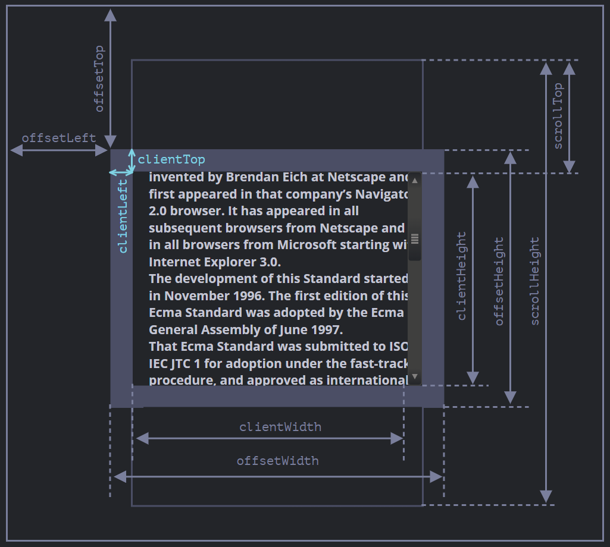
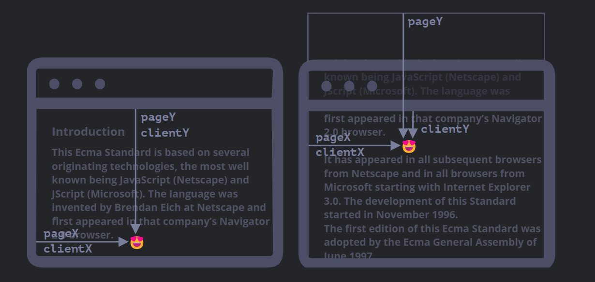
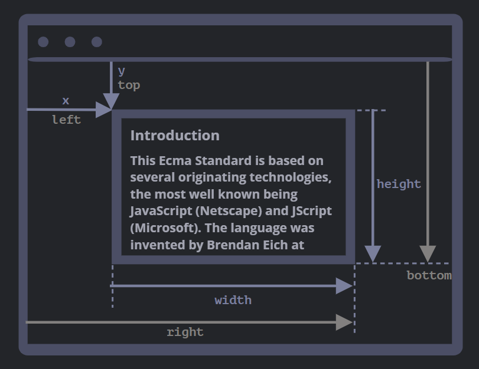

# Events and Forms

* Browser environment, specs
* DOM tree
* Walking the DOM
* Searching: getElement*, querySelector*
* Node properties: type, tag and contents
* Attributes and properties
* Modifying the document
* Styles and classes
* Element size and scrolling
  

Of All these properties only scrollTop and scrollLeft can be used to scroll, others are read-only.

NB - Conditions for scrolling is there must be an overflow and height. Element must have content that overflows.

```js
element.style.height = `${element.scrollHeight}px
```

```js
  $('div').onclick = function() {
    this.scrollTop += 10
  }

  let scrollBottom = elem.scrollHeight - elem.scrollTop - elem.clientHeight;
```

Use JavaScript to move an element to the middle/center of the page(this can be another element).

```js
  element.style.left = Math.round(page.clientWidth / 2) + 'px';
element.style.top = Math.round(page.clientHeight / 2) + 'px';

// factor the element width and height

element.style.left = Math.round(page.clientWidth / 2 - element.offsetWidth / 2) + 'px';
element.style.top = Math.round(page.clientHeight / 2 - element.offsetHeight / 2) + 'px';
```

> The difference between CSS width and clientWidth
>
> 1.clientWidth is numeric, while `getComputedStyle(elem).width` returns a string with px at the end.
>
> 2.getComputedStyle may return non-numeric width like "auto" for an inline element.
>
> 3.clientWidth is the inner content area of the element plus paddings, while CSS width (with standard box-sizing) is the inner content area without paddings.
>
> 4.If there’s a scrollbar and the browser reserves the space for it, some browser subtract that space from CSS width (cause it’s not available for content any more), and some do not. The clientWidth property is always the same: scrollbar size is subtracted if reserved.

* Window sizes and scrolling

Width and height visible window = `document.documentElement.clientWidth/clientHeight`

Width and Height of whole window with the scrolled out view = `Math.max(
  document.body.scrollHeight, document.documentElement.scrollHeight,
  document.body.offsetHeight, document.documentElement.offsetHeight,
  document.body.clientHeight, document.documentElement.clientHeight,
)`

Scroll with JavaScript with

1. window.scrollTo(pageX, pageY) - absolute coordinate of the window
2. window.scrollBy(x, y) - scroll relative to the current place/position
3. elem.scrollIntoView(top) - scroll to make elem visible either aligning to top/bottom of the window

```js
// all support smooth scrolling
window.scrollBy({ behavior: "smooth", left: 0, top: 20 });
window.scrollTo({ behavior: "smooth", left: 0, top: 0 });
element.scrollIntoView({ behavior: "smooth", block: "center" });
```

NB - Current scroll details of an element can be gotten with its scrollTop or scrollLeft, for a page use the `window.pageYOffset/pageXOffset` or `window.scrollX/scrollY`

Stop a page from scrolling using JavaScript:

```js
document.body.style.overflow = 'hidden'
// to restore scrolling
document.body.style.overflow = ''
```

* Coordinates
Relative to window (similar to position fixed) - clientX/clientY
Relative to document (similar to position absolute) - PageX/pageY



`elem.getBoundingClientRect()` - x/y width/height and top/bottom and left/right



left = x and top = y

right -> left + width

bottom -> top + height

`document.elementFromPoint(x, y)`

NB - Relative to the window – elem.getBoundingClientRect().
Relative to the document – elem.getBoundingClientRect() plus the current page scroll(window.pageYOffset/pageXOffset).

## Reference Links

* [JavaScript.info](https://javascript.info/document)
